<div align="center">

# Obhoy

### A multi-line blockchain claims-integrity protocol for low-trust insurance markets

**অভয়** — *freedom from fear*

[](https://hyperledger-fabric.readthedocs.io/)
[](https://go.dev)
[](https://soliditylang.org)
[](#13-evidence-the-thirteen-scenarios)
[](LICENSE)

**Md. Farhan Ishraq**¹ · **Didhiti Nahid**¹ · **Tamim Muhammad Rayeed**²

<sub>¹ Department of Computer Science and Engineering, Islamic University of Technology<br>
² Department of Nuclear Engineering, University of Dhaka</sub>

</div>

---

> In the final quarter of 2025, general insurers in Bangladesh settled **9.37%**
> of filed claims. Not *disputed* — nine in a hundred were paid.
>
> We think the reason is not fraud, or greed, or bad regulation. It is that
> **nobody can independently check that the insured event happened, because the
> only record comes from a party with a stake in it.** This repository is that
> argument, built and running.

```bash
git clone https://github.com/farhanishraq17/Obhoy.git && cd Obhoy && ./obhoy.sh dev
```

Then open **http://localhost:7545**. No Docker, no `npm install`, no build step.

---

## The paper and the poster

| | |
|---|---|
| 📘 **Whitepaper** | [`CutiePookieUrza_Whitepaper.pdf`](PaperPoster/CutiePookieUrza_Whitepaper.pdf) — 20 pages, IEEE format |
| 🖼️ **Poster** | [`CPU_FINAL_poster_14400x10800.pdf`](PaperPoster/Final-Whiteposter/CPU_FINAL_poster_14400x10800.pdf) — 14400 × 10800 px, 48 × 36 in at 300 dpi, landscape |
| 🎥 **Demo video** | *link to follow* |
| 💻 **Prototype** | this repository — [quick start](#12-quick-start), [runbook](docs/DEMO-RUNBOOK.md) |

<div align="center">
  <a href="PaperPoster/Final-Whiteposter/CPU_FINAL_poster_14400x10800.pdf">
    
  </a>
  <p><sub>Click through for the full-resolution PDF.</sub></p>
</div>

The paper is the argument. The poster is the argument on one sheet. This
repository is the part you can run, and the part that can be wrong in ways the
other two cannot.

---

## Contents

**The argument**
&nbsp;&nbsp;[1. The problem](#1-the-problem) ·
[2. Four failures, four mechanisms](#2-four-failures-four-mechanisms) ·
[3. Two objects, not one](#3-two-objects-not-one) ·
[4. The lifecycle](#4-the-lifecycle) ·
[5. Why blockchain](#5-why-blockchain-and-not-a-database)

**The system**
&nbsp;&nbsp;[6. Architecture](#6-architecture) ·
[7. Identity and privacy](#7-identity-and-privacy) ·
[8. Public anchoring](#8-public-anchoring) ·
[9. Governance](#9-governance) ·
[10. The reinforcing loop](#10-the-reinforcing-loop)

**The code**
&nbsp;&nbsp;[11. What is in this repository](#11-what-is-in-this-repository) ·
[12. Quick start](#12-quick-start) ·
[13. Evidence](#13-evidence-the-thirteen-scenarios) ·
[14. Limits](#14-what-this-does-not-prove) ·
[15. Findings](#15-findings-against-the-paper) ·
[16. Roadmap](#16-roadmap) ·
[17. Licence](#17-licence)

---

## 1. The problem

Insurance fails in low-trust markets largely because of **how the record is
kept**, not only because of how the risk is priced. And it is not one line of
business that fails.

<table>
<tr>
<td width="25%" align="center"><h3>9.37%</h3>of filed claims settled by Bangladeshi general insurers, Q4 2025</td>
<td width="25%" align="center"><h3>74%</h3>of health spending paid out of pocket, up from 55.9% in 1997 — the trajectory is worsening</td>
<td width="25%" align="center"><h3>2018</h3>the year the state made third-party motor cover <em>optional</em>, dropping a rule it could not enforce</td>
<td width="25%" align="center"><h3>$308.6bn</h3>the same problem in the United States, where it is priced rather than solved</td>
</tr>
</table>

Life insurers hold an uneasy 66–85% settlement rate. General insurers have
collapsed to fewer than one claim in ten. Crop-insurance research records
farmers calling insurance a *Ponzi scheme*. These look like four separate
markets failing for four separate reasons. They are one problem, and it
compounds.

### The loop that keeps it in place

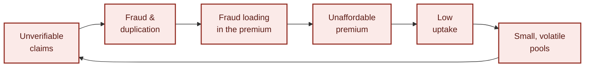

<div align="center"><em>Every arrow makes the next one worse, and capital cannot break in anywhere.</em></div>

### Four distinct verification failures

Separate problems, each needing its own answer.

| | Failure | What it means in practice |
|:--:|---|---|
| **1** | **The insurer cannot verify that the event occurred** | The claim arrives with evidence written by the party being paid: an invoice and discharge summary from the hospital, a damage assessment from the garage, a loss declaration from the farmer. Nothing independent confirms it |
| **2** | **No insurer can see another insurer's claims** | The same loss can be recovered twice across insurers who have no way to see each other, at any price |
| **3** | **Claimant-supplied evidence is the only measure of loss** | If the payout is computed from a document the claimant wrote, inflating that document is simply profitable |
| **4** | **The policyholder cannot verify the insurer** | A buyer cannot check whether an insurer actually pays before handing over a premium. So they assume it does not — correctly, at 9.37% |

---

## 2. Four failures, four mechanisms

The proposal, stated once:

> **Obhoy is a shared claims-integrity layer on which no single insurer, provider
> or intermediary holds the complete record of a claim.**

Everything else is an instance of that. Each failure gets one mechanism.

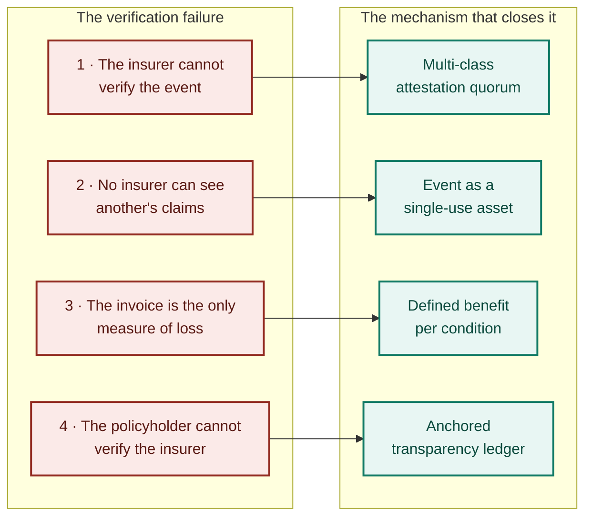

Read the project that way. Event uniqueness is the newest of the mechanisms,
but it is a mechanism, not the thesis. A system that only stopped duplicate
claiming would leave failures 1, 3 and 4 open — and those are the ones that stop
buyers believing the promise at all.

### The five mechanisms

| | Mechanism | Enforced by |
|:--:|---|---|
| **1** | **The event as a single-use asset.** No two open events may share a uniqueness key. In health that mirrors physical reality: a person cannot be admitted to two hospitals at once | Chaincode, refused **at commit** |
| **2** | **Multi-class attestation quorum.** Settlement needs at least two of three stakeholder classes, and at least one must not be getting paid | The **endorsement policy**, at protocol level — plus the non-payee half in chaincode |
| **3** | **Accreditation as a revocable credential.** A facility with a pattern of failed attestations is de-accredited on-chain, permanently, and cannot re-register clean | Chaincode; history survives revocation |
| **4** | **Published reserves and settlement ratio.** Every pool publishes, per period, premium written, claims received / settled / denied with reasons, mean settlement time and reserve position | Accrued from the claim path, anchored on a public chain |
| **5** | **Independent appeals.** Denial stays a human judgement. What the ledger fixes is that every denial is coded, counted, and sent to a panel whose decisions are themselves on the record | Chaincode, including the conflict rule |

---

## 3. Two objects, not one

This is the design decision everything else rests on, and getting it wrong
breaks the protocol in **two directions at once**.

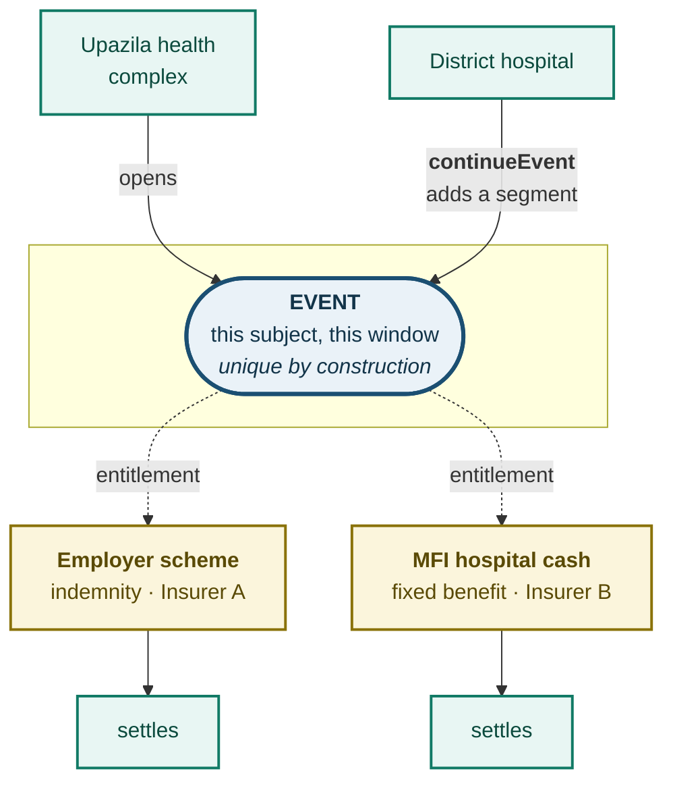

An **event** is the occurrence: this subject, this window. It is unique by
construction, because the invariant refuses a second open event on the same key.

An **entitlement** is a claim of cover against that event under **one** policy.
At most one exists per (event, policy) pair, and **settlement consumes the
entitlement, never the event.**

The relation is many-to-one, and it has to be:

<table>
<tr><td width="50%" valign="top">

#### Too strict, and you deny valid cover

A garment worker covered by an employer scheme *and* enrolled through an MFI
group holds two policies. A fixed-benefit hospital-cash product is **designed**
to pay alongside an indemnity policy.

Paying both is the contract, not a fraud. A protocol that blocked the second
payment because the event was "already claimed" would be rejected by a regulator
on first reading.

</td><td width="50%" valign="top">

#### Too loose, and you pay twice

What *is* fraudulent is **indemnity duplication** — recovering the same economic
loss twice. That is an arithmetic condition over the entitlement set, not a
uniqueness condition over events, and it is enforced as one:

$$\sum_{c \in \mathcal{I}(e)} \text{paid}(c) \leq \text{loss}(e)
\qquad
\sum_{c \in \mathcal{F}(e)} \text{paid}(c) \leq \text{cap}(e)$$

</td></tr>
</table>

> The ledger does not forbid the second claim — **it lets the second insurer see
> the first.** Which today no insurer can, at any price.

### The false positive that would break the deployment

A patient stabilised at an upazila health complex and then moved to a district
hospital produces **two admissions and one clinical episode**. A naive invariant
would see the receiving facility's assertion collide with the open event and
refuse it — denying a valid claim at the worst possible moment.

So the event allows a `continueEvent` transition. The receiving provider,
attested by the transferring one, adds an admission segment instead of opening a
new event. A readmission inside a set window links the same way and is judged
against a single benefit ceiling.

> **The invariant blocks duplicate payment, not repeated contact with the health
> system.** Getting that boundary wrong is how systems of this kind fail in the
> field.

### One primitive, four lines of business

Only **three parameters** change between lines. The chaincode, the governance
model and the transparency layer do not.

| | Uniqueness key | Attesting classes *(two of three, one non-payee)* | Settlement basis |
|---|---|---|---|
| **Health** | `H(NID commitment ‖ admission window)`<br/>*a person cannot be admitted twice at once* | Admitting hospital · independent clinician or diagnostic centre · MFI/NGO field agent at the bedside | Defined benefit per diagnosis–procedure group, published in advance |
| **Crop** | `H(parcel ID ‖ season)`<br/>*one parcel yields once per season* | Automated weather station · agricultural extension officer · MFI field agent or satellite index provider | **Parametric**: index breach at the registered station. No claim document at all |
| **Motor** | `H(vehicle ID ‖ incident timestamp)`<br/>*one collision per vehicle per moment* | Police or traffic authority · independent surveyor · workshop *(payee, cannot attest alone)* | Scheduled benefit by damage class, or a parametric total-loss trigger |
| **Property** | `H(parcel or asset ID ‖ peril window)` | Fire service or disaster authority · independent loss adjuster · local government record | Parametric for named catastrophe perils, scheduled otherwise |

Two points of honesty about scope. The key is strongest in health, where a
person can only be in one place, so a second assertion is refused at commit
rather than caught after payment. It is weakest in property, where one storm can
legitimately damage several insured assets. We do not claim equal fraud
resistance across lines.

The **Health** and **Crop** profiles are both registered on chain by the
demonstration seed, and nothing in the chaincode reads the line name — which is
how the generalisation claim gets checked rather than asserted.

---

## 4. The lifecycle

### Two state machines, because one cannot represent both correctly

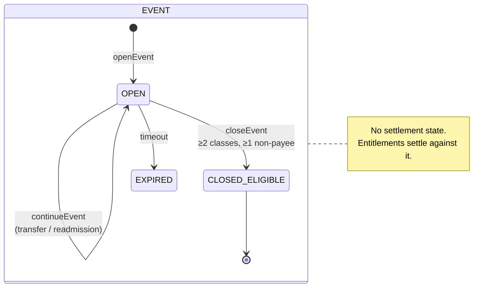

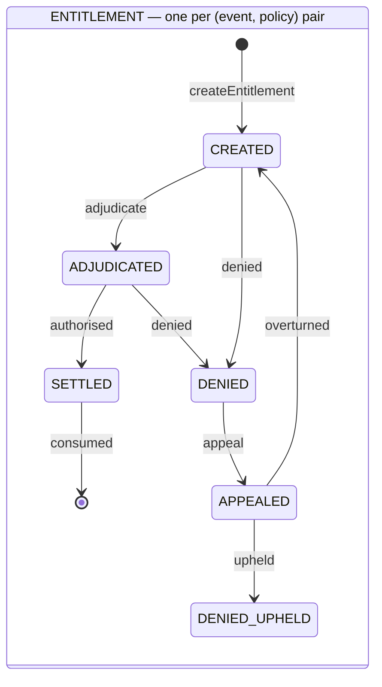

The **event** reaches `CLOSED_ELIGIBLE` once and stays there. It has no
settlement state of its own, so a second legitimate entitlement can still settle
against it later, and no transition re-opens a consumed event key.

The **entitlement** is what settlement actually consumes. Apart from an upheld
denial, `SETTLED` is its only terminal state.

### One claim, end to end, across seven roles

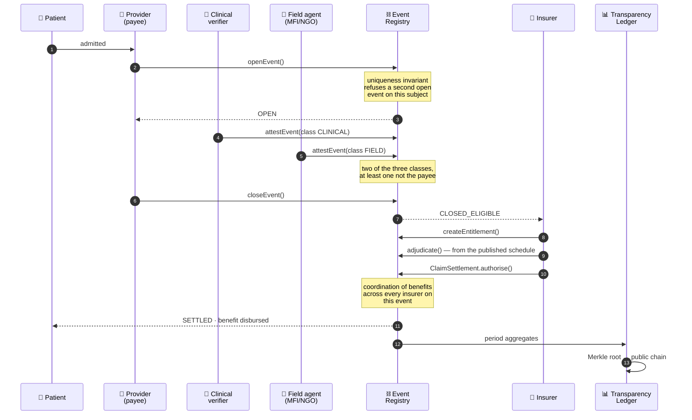

Every refusal `openEvent` can make, in the order it makes them:

```
1  the asserting party is not accredited          →  refused
2  the asserting party was de-accredited          →  refused  (Mechanism 3)
3  the subject is not enrolled                    →  refused
4  no cover was live at the time                  →  refused
5  this exact event key already exists            →  refused  (nothing re-opens a consumed key)
6  the subject already has an open event          →  refused  ← equation (4)
```

---

## 5. Why blockchain, and not a database

This is the first question a technical jury asks, and the honest answer is
narrow rather than broad.

<table>
<tr><th width="34%">Property</th><th width="33%">A shared central database</th><th width="33%">Obhoy</th></tr>
<tr>
<td><b>Refuse a duplicate <i>across</i> insurers</b></td>
<td>Needs one operator that every competing insurer trusts with its whole book. That operator does not exist, and would be a single point of capture if it did</td>
<td><b>Refused at commit</b>, with no party holding the complete record</td>
</tr>
<tr>
<td><b>Publish a settlement ratio a buyer can check</b></td>
<td>The operator can restate it, and nobody outside can tell</td>
<td><b>Merkle root anchored on a public chain</b>; a restated period no longer verifies</td>
</tr>
<tr>
<td><b>Enforce a multi-party quorum</b></td>
<td>Application code, which the operator can change</td>
<td><b>The endorsement policy</b> — a protocol rule, changed only by channel reconfiguration</td>
</tr>
<tr>
<td><b>Regulatory oversight</b></td>
<td>Periodic reports the regulator requests</td>
<td><b>IDRA holds a validating copy.</b> Supervision is architectural, not contractual</td>
</tr>
<tr>
<td><b>Raw throughput</b></td>
<td><b>Far higher</b></td>
<td>Slower, and it does not matter at the volume of catastrophic hospitalisations</td>
</tr>
<tr>
<td><b>Operational simplicity</b></td>
<td><b>Much simpler</b></td>
<td>Materially harder. A real cost, not a rhetorical concession</td>
</tr>
</table>

> We are not claiming a blockchain is better. We are claiming that **exactly one
> property here is unobtainable without one** — refusal at commit across
> mutually distrusting insurers with no trusted operator — and that the whole
> design is built on it.

---

## 6. Architecture

### The stack

```mermaid
flowchart TB
    subgraph L1 ["L1 · End-user surfaces"]
        direction LR
        U1["Policyholder app<br/><b>+ USSD/SMS</b>"]
        U2["Provider<br/>asserter"]
        U3["Verifier mobile<br/>(anonymous)"]
        U4["Insurer<br/>dashboard"]
        U5["Regulator &<br/>auditor"]
    end

    subgraph L2 ["L2 · Application"]
        direction LR
        A1["API gateway<br/>REST"]
        A2["Chaincode<br/>invocation SDK"]
        A3["Settlement<br/>adapter"]
        A4["Receipt &<br/>notification"]
    end

    subgraph L3 ["L3 · Middleware"]
        direction LR
        M1["Authentication<br/>+ role mapping"]
        M2["KYC / group<br/>enrolment"]
        M3["Off-chain anomaly<br/>scoring"]
        M4["<b>Domain profile</b><br/>key · classes · basis"]
    end

    subgraph L4 ["L4 · Blockchain — Hyperledger Fabric"]
        direction TB
        CC["<b>CHAINCODE</b> — 8 contracts, Go<br/>IdentityRegistry · PolicyRegistry · EventRegistry · BenefitSchedule<br/>ClaimSettlement · ProviderRegistry · TransparencyLedger · GovernanceCouncil"]
        NET["Endorsing peers (one per class) · Raft ordering O1–O5 · Fabric MSP<br/><b>AND(OutOf(2, P, C, V), InsurerMSP)</b>"]
    end

    subgraph L5 ["L5 · Data"]
        direction LR
        D1["On-chain state<br/>commitments"]
        D2["Private data<br/>collections"]
        D3["Encrypted<br/>off-chain store"]
        D4["Public explorer<br/>aggregates"]
    end

    subgraph EXT ["External rails — beyond the trust boundary"]
        direction LR
        X1["National ID<br/>(A2)"]
        X2["Hospital HMIS<br/>/ DGHS"]
        X3["bKash / Nagad<br/>/ Rocket"]
        X4["Insurer core<br/>/ IDRA"]
        X5["Public chain<br/>anchor"]
    end

    L1 --> L2 --> L3 --> L4 --> L5
    L5 -.-> EXT

    classDef surface fill:#EAF2F8,stroke:#1B4F72,color:#123449
    classDef core fill:#E8F6F3,stroke:#117A65,stroke-width:2px,color:#0B4A3D
    classDef ext fill:#F4F4F4,stroke:#5D6D7E,stroke-dasharray:4 3,color:#33414D
    class U1,U2,U3,U4,U5,A1,A2,A3,A4,M1,M2,M3,D1,D2,D3,D4 surface
    class CC,NET,M4 core
    class X1,X2,X3,X4,X5 ext
```

Everything below the dashed boundary is a system Obhoy integrates with but does
not control — which is why A1 and A2 are assumptions rather than guarantees.

### Network topology

Twelve organisations. Five ordering nodes, **each in its own MSP** — five
orderers in one organisation would look identical in `docker ps` and would mean
nothing, because one organisation would still hold the whole ordering service.

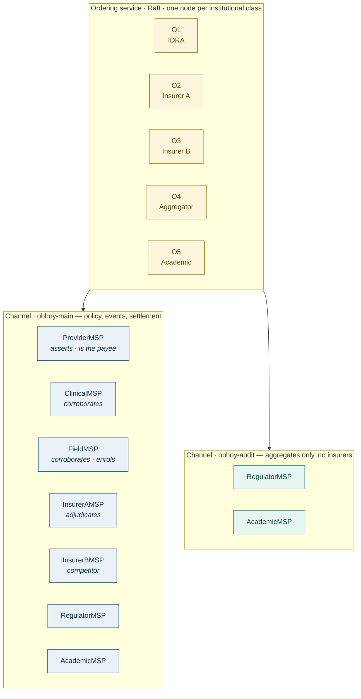

> Raft is **crash-fault tolerant, not Byzantine**. Institutional spread bounds
> *who can stall* the service. It does not make a malicious ordering majority
> harmless, and we do not claim otherwise.

### The endorsement policy is the architectural claim

```
AND(OutOf(2, 'ProviderMSP.peer', 'ClinicalMSP.peer', 'FieldMSP.peer'),
    OutOf(1, 'InsurerAMSP.peer', 'InsurerBMSP.peer'))
```

Read back out of the generated genesis block, not out of a file:

```json
{"n_out_of": {"n": 2, "rules": [
  {"n_out_of": {"n": 2, "rules": [{"signed_by": 0}, {"signed_by": 1}, {"signed_by": 2}]}},
  {"n_out_of": {"n": 1, "rules": [{"signed_by": 3}, {"signed_by": 4}]}}]}}
```
> identities: `ProviderMSP/PEER`, `ClinicalMSP/PEER`, `FieldMSP/PEER`, `InsurerAMSP/PEER`, `InsurerBMSP/PEER`

The `OutOf(2, …)` term **is Mechanism 2**. The insurer signs as *payer*, not as a
third attesting class. Soften this to `MAJORITY Endorsement` and the quorum is
enforced only by application code — the mechanism becomes a convention, and
every test in this repository still passes. `Test_Runs/check-network.sh` exists
to catch exactly that.

It lives in the **channel configuration**, not in a deploy-time flag. A policy
supplied on a command line can be changed at the next deploy without a
configuration update, and a multi-class quorum is not something one organisation
should be able to loosen alone.

### Private data collections

| Collection | Readable by | Why it exists |
|---|---|---|
| `insurerA_terms` / `insurerB_terms` | that insurer only | Competing insurers settle on one channel while keeping pricing and reserving out of each other's sight. **Without this the consortium is commercially impossible** |
| `enrolment_pii` | enrolling aggregator + insurer | The mapping back to a real person. Neither party holds the PRF key that produced the commitment — two secrets, two custodians |
| `clinical_refs` | providers, clinicians, insurers | Content hashes and access envelopes. **Field verifiers are absent by design**: they attest that an admission happened and never see clinical data |

---

## 7. Identity and privacy

### How a person becomes a ledger entry

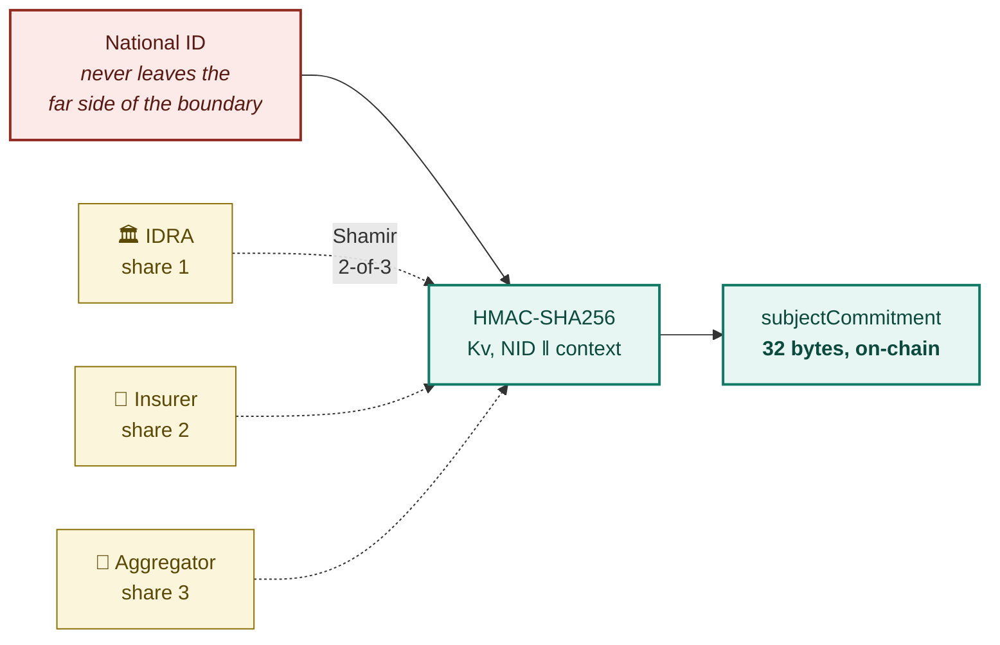

Three things about this are easy to get wrong, and all three matter:

**It is keyed, not a bare hash.** A SHA-256 of a national identity number is not
a pseudonym. The space is small enough to enumerate, so the digest *is* the
number.

**There is one key across the network, not a salt per insurer.** Independent
salts would mint a different commitment per insurer for the same person, which
silently breaks the cross-insurer invariant. The mechanism would appear to work
while doing nothing at all.

**The key is never held whole.** No single class can compute a commitment, and
no single class can be compelled to.

`context` domain-separates the uses, so the commitment that keys an event is not
the one that binds a policy credential and a leak in one does not unlock the
other. Key version travels with every commitment, so a compromise can be scoped
and retired.

> Worth doing live: take one custodian offline and commitments still issue, from
> a different pair, at the **identical** value. Take a second offline and they
> stop. Nothing degrades gracefully in between — that is the property.

### On-chain and off-chain

| On-chain | Off-chain |
|---|---|
| Policy credential (NID commitment) | NID numbers, names, addresses |
| Event record, state, timestamps | Clinical notes, imaging, labs |
| Attestation signatures + class | Itemised invoices |
| Benefit schedule version hash | Insurer actuarial models |
| Settlement authorisation, denial code | Bank / MFS account details |
| Provider accreditation history | Biometric templates |
| Period transparency aggregates | Documents *(content hash on-chain only)* |

No single on-chain field is protected health information on its own. A test
dumps the entire world state on every build and fails if anything shaped like a
national identity number, a name or a free-text diagnosis appears.

> [!WARNING]
> **That is not the same claim as anonymity.** Category code, subject
> commitment, provider identity and timestamps together are a metadata surface:
> a party seeing enough of them, over enough periods, can plausibly link a
> subject to an illness category without ever reading a diagnosis field. Hashes
> and pseudonyms are not automatically anonymous. Private data collections scope
> who sees which combination; the residual is a data-protection question, and we
> treat it as one.

### Key management — the honest problem

**This population cannot be asked to manage private keys.** A scheme that costs a
widow her cover because she lost a seed phrase is worse than no scheme.

| Who | How | Recovery |
|---|---|---|
| **Policyholders** | Custodial keys held by the aggregator | Field agent **plus** a second household member — the social recovery mobile-money users already know |
| **Providers and verifiers** | Device-bound keys in mobile secure elements | On-chain revocation |
| **Institutional members** | HSMs with documented rotation | Threshold custody across classes |

---

## 8. Public anchoring

A consortium can be captured or legally compelled. If the transparency totals
live only inside it, it can rewrite them, and the whole trust proposition
collapses.

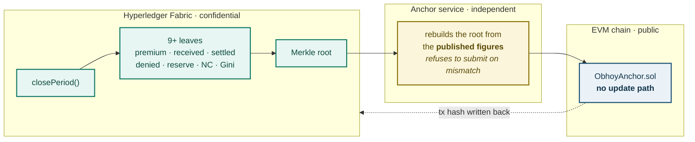

> **Confidentiality inside, immutability outside. Neither half works alone.**

Two details that are easy to get wrong and are not:

The anchor script **rebuilds the root itself** before submitting, and refuses on
mismatch. Anchoring a root the chaincode handed over would only prove that the
chaincode agrees with itself.

`ObhoyAnchor.sol` **has no update path**. If a period could be re-anchored, an
insurer that restated its settlement ratio could restate the commitment to
match, and a reader could not tell. A mistake is corrected by anchoring a *new*
period that supersedes the old one, in public.

> [!IMPORTANT]
> **Anchoring binds integrity after inclusion, not completeness.** A claim that
> never reached the ledger is absent from the tree, and the root commits
> faithfully to a record missing it. Membership narrows that gap — writes come
> from parties with opposed interests, so omission needs all of them to agree to
> it — but no smart contract closes it.

There is **no token**. No cryptocurrency, no speculative instrument. All money
moves in taka through regulated mobile financial services and banking rails,
outside both ledgers. The contract stores 32 bytes per period and nothing else.

---

## 9. Governance

These weights govern the council's **own votes** — charter amendments, upgrade
approval, member admission and off-boarding. They do not govern transaction
validation, which runs on the endorsement policy and Raft ordering and which no
weight table alters. Conflating the two is the most common way a consortium
design is misread.

| Stakeholder class | Weight | |
|---|---:|---|
| Insurers *(collectively)* | **0.30** | ██████ |
| IDRA *(regulator)* | **0.20** | ████ |
| MFI / NGO aggregators | **0.20** | ████ |
| Provider association | **0.15** | ███ |
| Independent academic auditor | **0.15** | ███ |

Sorted cumulative weight runs **0.30 → 0.50 → 0.70**. Two classes cannot reach a
majority and three can, so the **Nakamoto Coefficient is 3**.

<div align="center">

| Metric | Value | Bound | Within |
|---|---|---|---|
| Nakamoto Coefficient | **3** | floor 3 | yes |
| Gini coefficient | **0.14** | ceiling 0.20 | yes |
| Largest class | **0.30** | cap 0.30 | yes |

</div>

### The metrics bind rather than describe

Both are recomputed **on-chain, every period**, and a new class is admitted only
if admission keeps the Nakamoto Coefficient at 3 or above and the Gini at or
below 0.20.

```
propose  insurers → 0.35                     →  REFUSED  before any vote
propose  four classes at 0.30/0.30/0.20/0.20 →  REFUSED  Nakamoto Coefficient would fall to 2
propose  a sixth class within the caps       →  accepted → 0.30+0.20+0.20 = 0.70 carries
```

> **The council cannot vote itself past its own concentration limits.**

Both measure concentration of *formal* authority, not independence of
incentives: classes can be constitutionally separate and still align
commercially. **A floor on dispersion, not proof against capture.**

Conflict rules live in chaincode rather than in a policy document: the provider
association may not help validate claim decisions affecting its own member
facilities, and insurers may not help validate appeals against their own
denials.

---

## 10. The reinforcing loop

The mechanisms compose into a loop no conventional insurer can copy.

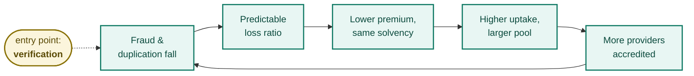

Fraud and duplication fall, so the loss ratio becomes predictable. Predictable
losses allow a lower premium at the same solvency margin. A lower premium plus a
*checkable* settlement record raises uptake among buyers who assumed insurers
never pay. Higher uptake enlarges the pool, which cuts variance and unit
administrative cost. Larger, cheaper pools pull more providers into seeking
accreditation, which widens attestation coverage and cuts fraud again.

> **The loop starts at verification, not at capital.** That is why a
> student-scale pilot can enter it and not only a large incumbent.

---

## 11. What is in this repository

```
obhoy/
├── chaincode/obhoycc/          Go — the eight contracts, and the ledger itself
│   ├── contracts/              identity · policy · provider · schedule
│   │                           event · settlement · transparency · governance
│   ├── invariants/             Appendix A of the paper, in code
│   ├── model/                  object model · key derivation · Merkle
│   ├── internal/ledgerstub/    an in-process ChaincodeStubInterface
│   ├── internal/httpapi/       the REST surface and the demonstration seed
│   ├── internal/scenarios/     the adversarial harness
│   └── cmd/
│       ├── chaincode/          the Fabric entry point
│       ├── localnode/          the same contracts, in-process, over HTTP
│       └── scenarios/          the harness as a command
├── web/                        the application — no framework, no build step
├── services/                   off-chain services — zero dependencies
├── gateway/                    REST over a real Fabric peer, identical surface
├── network/                    configtx · compose · the network script
├── anchor/                     ObhoyAnchor.sol and its Hardhat project
├── Test_Runs/                  the runner, and captured evidence per run
├── PaperPoster/                the whitepaper and the poster
└── docs/                       limitations · findings · runbook · architecture
```

### The eight contracts

| Contract | Carries |
|---|---|
| `IdentityRegistry` | Subject commitments, key versions, the disclosure log |
| `PolicyRegistry` | Non-transferable policy credentials bound to a commitment |
| `ProviderRegistry` | Revocable accreditation with surviving history; anomaly flags |
| `BenefitSchedule` | Versioned, append-only, published in advance |
| `EventRegistry` | **The uniqueness invariant.** Open, attest, continue, close |
| `ClaimSettlement` | Entitlements, coordination of benefits, denials, appeals |
| `TransparencyLedger` | Period accruals, Merkle roots, anchor records |
| `GovernanceCouncil` | Weighted votes, on-chain Nakamoto and Gini, the admission gate |

### One decision worth explaining

The contracts are **written once and run two ways**. `cmd/chaincode` is the
Fabric entry point; `cmd/localnode` runs *the same contract functions* against an
in-process ledger and serves them over HTTP. The seam is a single variable that
resolves the caller's organisation — from a validated X.509 identity under
Fabric, from the stub under the local node.

That is why the web application, the thirteen scenarios and the privacy dump all
work with nothing installed but Go, **and why none of them is a mock**.

What the local node does *not* provide is everything outside chaincode:
endorsement, ordering, MSP validation, private-data confidentiality. Those are
real properties and they exist only on the real network.

---

## 12. Quick start

### The demonstration — Go only

```bash
./obhoy.sh dev            # or  .\obhoy.ps1 dev  on Windows
```

Open **http://localhost:7545**. The node bootstraps a demonstration network on
start-up — five council classes, two domain profiles, seven accredited parties, a
published benefit schedule, eight synthetic subjects, ten policies, two open
reporting periods — and prints every transaction as it commits.

The fastest route to the part that matters: open the **Claim desk** as *Provider
association* and assert an admission. Then assert the **same subject from a
different facility** without closing the first. That refusal is the whole
argument in one screen. Attest it as *Independent clinician*, then settle it as
*Insurer A*, and watch the **Published record** fill in.

The **Harness** tab runs all thirteen scenarios, and the **Ledger** tab shows
every transaction including the refused ones, alongside the entire world state
with the identifier scan over it.

### Services and anchoring — plus Node 20

```bash
./obhoy.sh services       # nine processes, ports 7551–7565
./obhoy.sh anchor test    # the Solidity contract
```

### The real Fabric network — plus Docker, from WSL2

```bash
./obhoy.sh fabric up demo       # crypto material, 13 containers, two channels
./obhoy.sh fabric deploy demo   # package, install, approve ×7, commit
./obhoy.sh fabric status demo
```

> [!CAUTION]
> **Run this from WSL2 Ubuntu with the repository on the ext4 filesystem — not
> `/mnt/d`.** Fabric requires TLS private key files to be mode 0600 and the
> Windows mount cannot represent that. The peers start, then fail the handshake,
> and the error looks like a certificate problem and is not one. This one costs
> an afternoon if you meet it late.

Full detail in **[docs/RUNNING.md](docs/RUNNING.md)**.

---

## 13. Evidence: the thirteen scenarios

Each is a scripted run with an asserted outcome. **Nine of them pass by
producing a refusal** — the ledger declining to write something is the property
being demonstrated. Each runs against its own freshly bootstrapped network.

```bash
./obhoy.sh scenarios          # all thirteen
./obhoy.sh scenarios S2       # just the headline
```

| | Scenario | Establishes | Criterion |
|:--:|---|---|---|
| **S1** | Happy path: a claim settles | Assert → corroborate → close → adjudicate → authorise | Problem & Solution |
| **S2** | 🔴 **Cross-insurer duplicate refused at commit** | Two facilities, two insurers who cannot see each other. Refused **before it is written** | Problem & Solution |
| **S3** | Second entitlement on the same policy refused | An entitlement is consumed once | Problem & Solution |
| **S4** | 🟢 **Genuine dual cover pays** | Employer indemnity **and** MFI hospital cash both settle | Problem & Solution |
| **S5** | Transfer between facilities settles once | Two admissions, one episode, one benefit | Problem & Solution |
| **S6** | Readmission inside the window links | One benefit ceiling per episode | Problem & Solution |
| **S7** | Payee cannot corroborate itself | Nobody is paid on the payee's word | Architecture |
| **S8** | De-accredited provider cannot re-register clean | Revocation is permanent and visible | Governance |
| **S9** | Denying insurer cannot decide the appeal | The conflict rule is in chaincode | Governance |
| **S10** | Period anchored; tampering detected | A restated figure no longer verifies | Problem & Solution |
| **S11** | Access control and the world state | Roles are structural; no identifier on the ledger | Privacy & Security |
| **S12** | Payout instructions are payload-bound | The ledger authorises payment, it does not execute it | Architecture |
| **G1** | Governance caps bind, not describe | Admission gated on measured decentralisation | Governance |

> If you have time for one, make it **S2**. If you have time for two, the second
> is **S4** — because it is the one that shows the mechanism is not simply
> strict.

### What has been run

Captured evidence lives in [`Test_Runs/`](Test_Runs/), one timestamped directory
per run, with the raw output of every suite alongside the summary.

| Suite | Result |
|---|---|
| Chaincode — Go tests, one per invariant plus the cases that must not fail | **21 pass** |
| Services — threshold custody, keyed-PRF properties, Merkle vectors | **7 pass** |
| Adversarial harness | **13 of 13** |
| `ObhoyAnchor.sol` | **7 pass** |
| Per-step analysis — did each refusal cite the right invariant? | **101 steps, all matched** |
| `configtx.yaml` — three channel genesis blocks, endorsement policy verified in the block | **passes** |
| End-to-end anchoring — ledger → independent rebuild → on-chain → recorded back | **works** |

Every test name carries the equation number from Appendix A of the paper, so the
appendix and the suite can be diffed line by line:

```
TestOpenEvent_RefusesDuplicateKey              equation (4)
TestContinueEvent_SameSubjectUnsettled         equation (5)
TestCloseEvent_RefusesSingleClass              equation (6)
TestInvariant_NonPayeeAttestationRequired      equation (7)
TestEntitlement_RefusesSecondOnSamePolicy      equation (8)
TestSettle_RefusesReopenedOrLapsed             equation (9)
TestCOB_CapsIndemnityAndFixedSeparately        equation (2)

TestTransfer_Settles                           ← must not fail
TestReadmission_SettlesOnce                    ← must not fail
TestDualCover_BothPoliciesSettle               ← must not fail
```

One gap worth naming: equations **(2)** and **(5)** refuse correctly in the unit
suite, but no *scenario* demonstrates the refusal — S4, S5 and S6 only exercise
their success paths. The tests cover them, so this is a thinner demonstration
rather than a correctness problem.

---

## 14. What this does not prove

> [!IMPORTANT]
> The paper's credibility comes from stating its own limits, and a prototype
> that quietly widened its claims would undo that. The full list is
> [docs/LIMITATIONS.md](docs/LIMITATIONS.md), and it is worth reading before the
> code.

| | Limit |
|---|---|
| 🔴 | **Assumption A2 — identity resolution — is assumed, not demonstrated.** There is no national ID verification service here. Two identities for one person defeat the invariant *before* chaincode is entered. This is the strongest guarantee in the paper and the one the prototype cannot test |
| 🔴 | **The seven-organisation Fabric network has not been brought up.** Its configuration is validated — crypto material generates, all three genesis blocks build, the endorsement policy was read back out of the block — but no container has been started |
| 🟡 | **Assumption A1 — membership.** A claim settled off-network is invisible |
| 🟡 | **Anonymous attestation is partial.** Fabric does not extend Idemix to endorsement; the paper concedes this. The ledger record has the right shape, the cryptography behind it does not yet |
| 🟡 | **Private data confidentiality is configured, not observed failing.** The in-process ledger implements the API without MSP enforcement |
| 🟡 | **Payment is mocked.** The adapter reproduces the semantics, not bKash |
| 🟡 | **`cryptogen`, not Fabric CA.** No registration, no enrolment, no CRL |
| 🟡 | **Raft is crash-fault tolerant, not Byzantine** |
| 🟡 | **Scale is untested.** Toy volumes, one machine. No throughput number is claimed anywhere |
| 🟡 | **No legal or DPIA finding.** An engineering posture, not a compliance one |
| 🟡 | **Metadata linkage is mitigated, not eliminated** |
| 🟡 | **Nothing here has been priced.** A prototype can show the verification works. It cannot show the premium falls |

And the one row in the fraud taxonomy we do not claim to have solved:

> **Payee–verifier collusion.** A facility and a verifier who always work
> together produce attestations that are individually valid in every way the
> chaincode can check. Detection is statistical and lives off-chain; the *flag*
> lives on-chain, because a warning an operator can quietly drop is not a
> control. **A flag is a place to look, not a finding.**

---

## 15. Findings against the paper

Building the prototype turned up things the paper gets wrong or leaves
ambiguous. They are recorded rather than quietly patched, because the paper is
the deliverable being defended. Full detail in
**[docs/FINDINGS.md](docs/FINDINGS.md)**.

| | Finding |
|---|---|
| **1** | **The comparison Gini of 0.26 does not follow from the paper's own formula.** That formula reproduces Obhoy's 0.14 exactly, which is what makes the other figure conspicuous — applied to 0.4/0.3/0.3 it gives **0.0667**. Correctly computed, the Gini says the *opposite* of what the paragraph claims. The Nakamoto Coefficient half (3 vs 2) is sound and is the binding metric |
| **2** | **The event state list contradicts the state machine.** The prototype implements the state-machine reading — the event has no settlement state — because the dual-cover case depends on it. The field list needs a one-line correction |
| **3** | **Equation (7) is implied by (6) under every profile in the paper.** It is a redundant guard, and stops being redundant the moment a profile designates more than one payee-side class. Kept and tested on its own terms |
| **4** | **"`openEvent` checks the policy is active" needs a reading.** An event is policy-independent; implemented as *at least one* live policy |
| **5** | **The continuation window is unspecified.** Made a domain-profile parameter — 30 days for health, 120 for crop |

---

## 16. Roadmap

Where this prototype sits in the paper's phase plan.

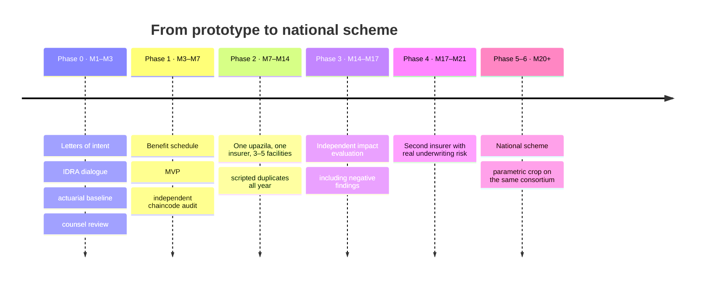

This repository is the technical half of Phase 1. What it does not carry is the
half that decides whether the project happens at all: a licensed insurer, an
aggregator, and an actuary.

### The decision gates

The project narrows, pivots or stops if any of these happens. Stating them in
advance is what makes the proposal testable rather than promotional.

1. An actuary concludes the defined-benefit schedule cannot be priced at a
   premium the target cohort can pay while remaining solvent.
2. No licensed insurer and no aggregator will validate the integration
   assumptions — in which case Obhoy remains architecture research rather than a
   deployment claim.
3. IDRA advises that claims infrastructure of this form cannot be operated
   without a risk-carrier licence.
4. **The prototype cannot enforce the single-open-event invariant, the
   continuation rule or multi-class endorsement under adversarial test — or
   enforces them so bluntly that legitimate transfers and dual cover are
   refused.** *(This is the gate this repository answers, and it passes.)*
5. Pilot data shows the fraud reduction achieved is too small to move the
   premium — in which case the affordability thesis, not the technology, has
   failed.

---

## 17. Licence

**Apache-2.0.** See [LICENSE](LICENSE).

Apache rather than MIT for one reason that matters here: it carries an explicit
patent grant. A protocol proposed as shared infrastructure that several
competing insurers are meant to settle on should not leave any of them exposed
to a patent claim from another contributor.

One file is third-party — `network/config/core.yaml`, redistributed verbatim from
Hyperledger Fabric v2.5.10 (Apache-2.0, © IBM Corp.), with its headers intact.
[NOTICE](NOTICE) records it. Everything else here is ours.

---

<div align="center">

### Further reading

[**Architecture**](docs/ARCHITECTURE.md) &nbsp;·&nbsp;
[**Limitations**](docs/LIMITATIONS.md) &nbsp;·&nbsp;
[**Findings**](docs/FINDINGS.md) &nbsp;·&nbsp;
[**Running it**](docs/RUNNING.md) &nbsp;·&nbsp;
[**Demo runbook**](docs/DEMO-RUNBOOK.md) &nbsp;·&nbsp;
[**Test runs**](Test_Runs/)

---

*Beyond the ledgers and loss ratios, Obhoy exists for one reason: to make sure a
family's hardest moment is met with a safety net rather than a financial
freefall.*

---

<sub>Everything in this repository is synthetic. No real person, facility, policy
or national identity number appears anywhere in it; the demonstration
identifiers are structurally invalid by construction, and a test fails the build
if anything identifier-shaped reaches the ledger.</sub>

<sub>Blockchain Olympiad Bangladesh · SDG 1 · SDG 3.8 · farhanishraq17@iut-dhaka.edu</sub>

</div>
